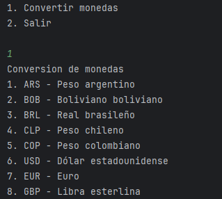
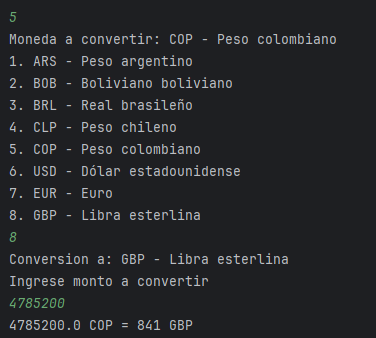
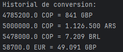
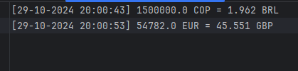

# Currency conversion

Desktop application with Java that allows API consume to convert different countries currency, it has conversion logs and historial conversion that shows in console.

## Resources

- [**Format number**](https://www.baeldung.com/java-number-formatting): That source allow me to implement format number method.
- [**Reference to convert**](https://www.xe.com/es/currencyconverter): I was inspired by this website to know what to keep in mind.
- [**Format dates**](https://www.w3schools.com/java/java_date.asp): This source helps me to format date and put actual datetime in file in order to save logs.
- [**Ternary**](https://www.geeksforgeeks.org/java-ternary-operator-with-examples/): This source shows me how to implement ternary in Java.
- [**Variables enviroment**](https://stackoverflow.com/questions/13748784/setting-up-and-using-environment-variables-in-intellij-idea): This source shows how to implement variables enviroment in Java with IntelliJ.

## Results

Image with main view of application.

Image that shows conversion process. 

Image with historial conversion of currencies.

Image with conversion logs.

